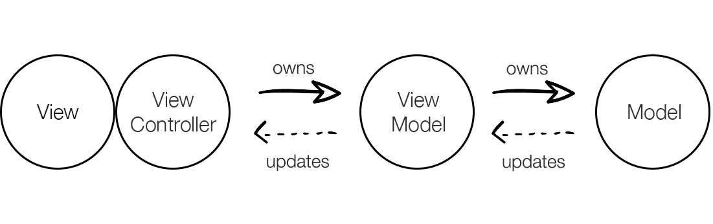
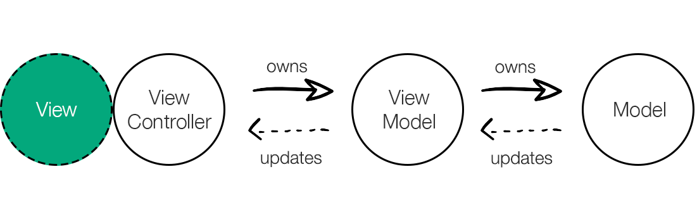
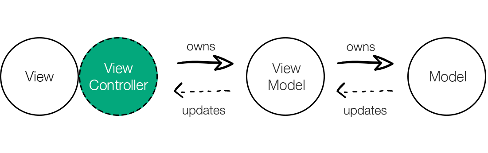
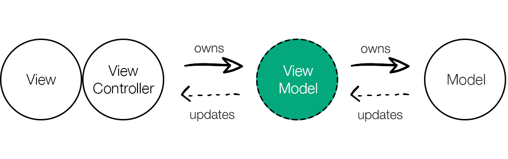
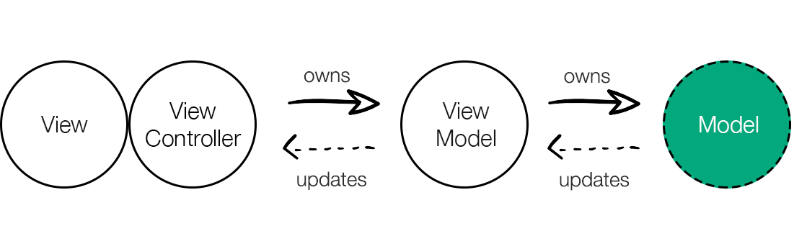

# React TypeScript MVVM


This is the MVVM TypeScript template for [Create React App](https://github.com/facebook/create-react-app).

To use this template, add `--template typescript-mvvm` when creating a new app.

For example:

```sh
npx create-react-app my-app --template typescript-mvvm

# or

yarn create react-app my-app --template typescript-mvvm
```

For more information, please refer to:

- [Getting Started](https://create-react-app.dev/docs/getting-started) – How to create a new app.
- [User Guide](https://create-react-app.dev) – How to develop apps bootstrapped with Create React App.

# MVVM Pattern

MVVM has four main blocks:

- The View — UI layer that users interact with,
- The ViewController —has access to the ViewModel and handles user input,
- The ViewModel — has access to the Model and handles business logic,
- The Model — application data source



## View

With React we’re building user interfaces and this is what most of us are already familiar with. The View is the only touching point for a user with your application. A user will interact with your View that will trigger ViewController methods depending on events such as mouse movements, key presses etc. The View is not only used for a user input but also for displaying output — results of some actions.
The View is a dumb, presentational React.Component which means that it should be used only for displaying data and triggering events passed from the ViewController. This way, we’re keeping our components reusable and easy to test. **With the help of MobX, we’ll turn React.Componentinto reactive component that will observe any changes and automatically update itself accordingly.**



## ViewController

The ViewController is a brain for the View — it has all View related logic and owns a reference to the ViewModel. The View is not aware of the ViewModel and it is relying on the ViewController to pass all necessary data and events.
Relation between the ViewController and the ViewModel is one-to-many — one ViewController can have references to different ViewModels.
Handling user input shouldn’t be left to the ViewModel but rather handled in the ViewController that will pass clean and prepared data to the ViewModel.



## ViewModel

The ViewModel is a producer who doesn’t care who consumes data; it can be React component, Vue component, aeroplane or even a cow, it simply doesn’t care. Because the ViewModel is just a regular JavaScript class it can be easily reused anywhere with UI tailored differently. Every dependency needed by the ViewModel will be injected through the constructor, thus making it easy to test. The ViewModel is interacting directly with the Model and whenever the ViewModel updates it, all changes will be automatically reflected back to the View.



## Model

The Model is acting as a data source ie. global store for the application. It composes all data from the network layer, databases, services and serve them in a easy way. It shouldn’t have any other logic except one that actually updates a model and doesn’t have any side effects.



## Provider

One component that is not part of the MVVM but we’ll use it to glue everything together is called Provider. This component will instantiate ViewModel and provide all needed dependency to it. Furthermore, instance of the ViewModel is passed through props to the ViewController component.
Provider should be clean, without any logic as its purpose is just to wire up everything.

## Source

- [Medium, COBE, Danijel Vincijanovic](https://medium.cobeisfresh.com/level-up-your-react-architecture-with-mvvm-a471979e3f21)

And updated with the last version of Mobx and project structure.
